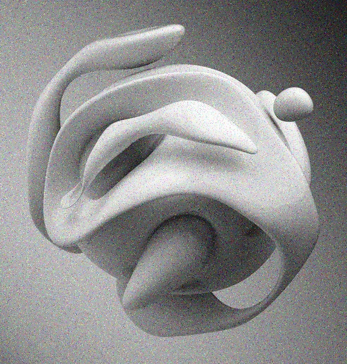
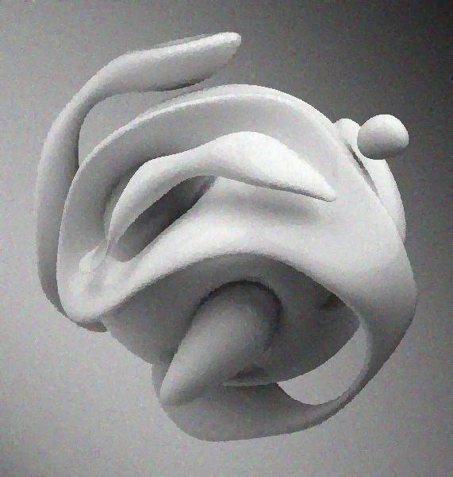
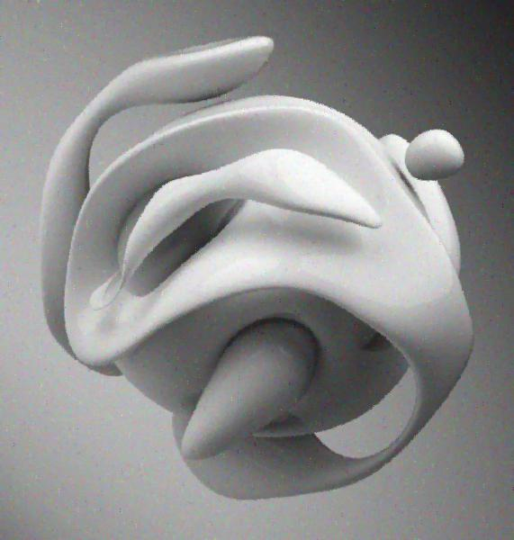
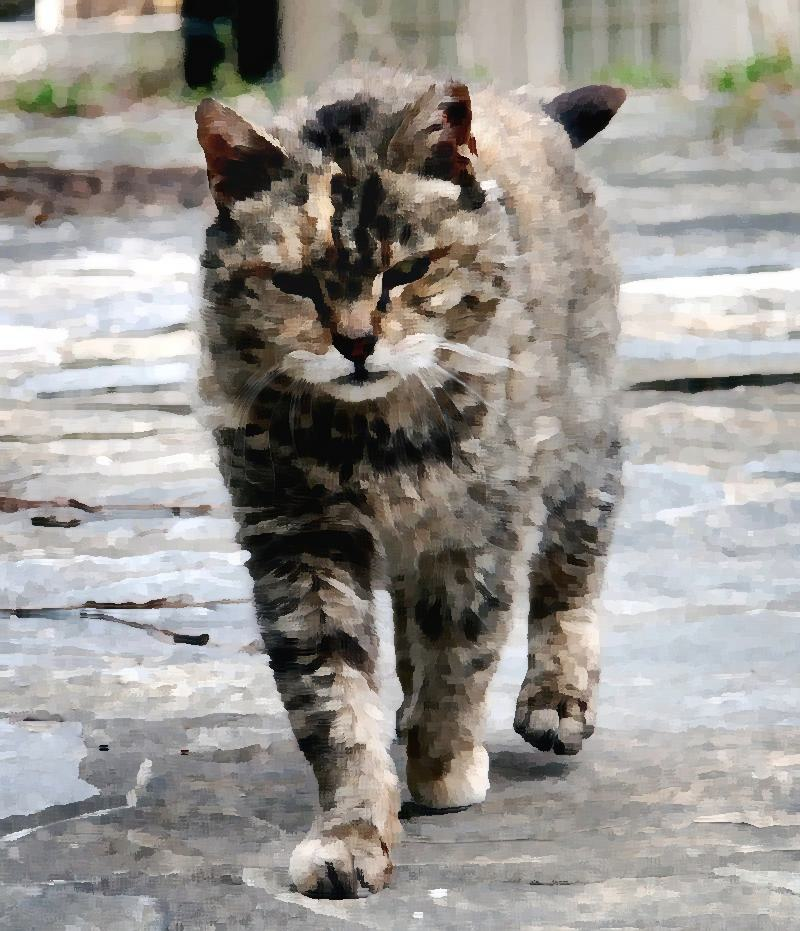
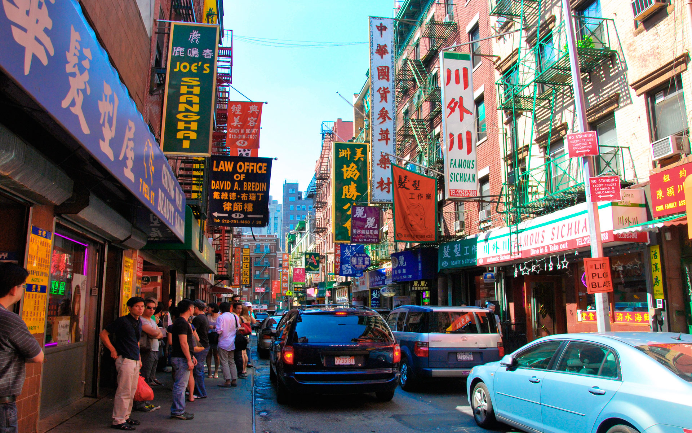
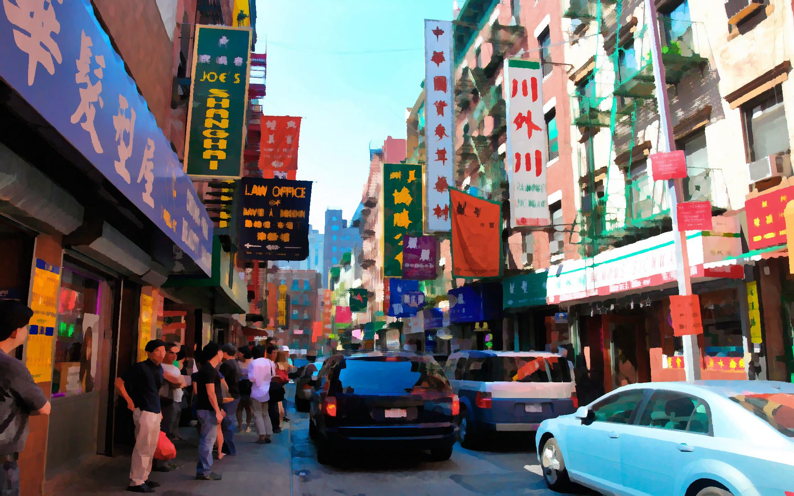

# kuwahara-torch
Kuwahara filter in PyTorch.

# Examples
See full code and images on [example](example/) dir.

Originally Kuwahara filter was used for denoising.
| Original                | Kuwahara                | Generalized Kuwahara                |
|------------------------|------------------------|------------------------|
|  |  |  |

But now it is used for artistic style.
| Original                | Kuwahara                | Generalized Kuwahara                |
|------------------------|------------------------|------------------------|
|  |  |  |

| Original                | Generalized Kuwahara                |
|------------------------|------------------------|
|  |  |

# TODO
* add papers and references etc
* clear notes

